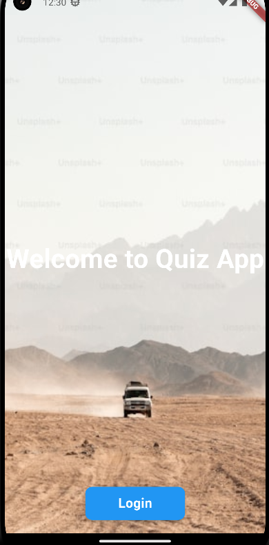
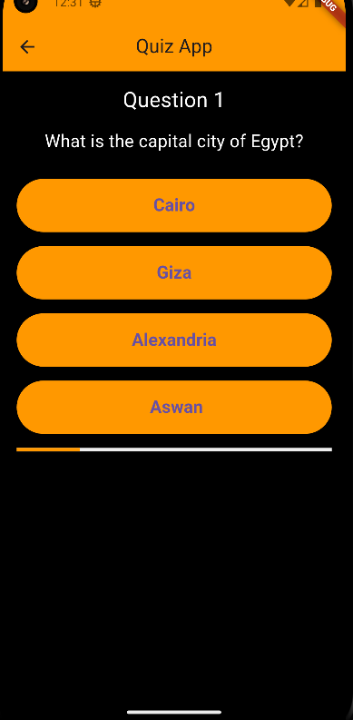
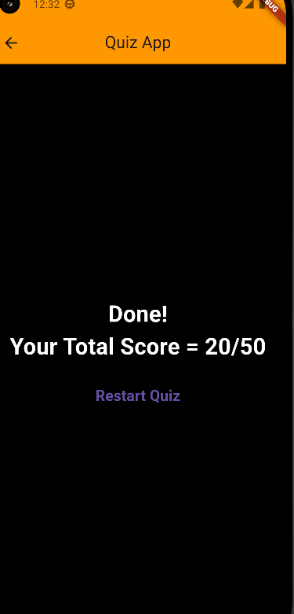

---

# Quiz App

A simple, interactive quiz app that tests your knowledge about Egypt. This app presents a series of multiple-choice questions, where users can select an answer and receive instant feedback. It tracks the user's score and provides an option to restart the quiz once it's completed.

## Features

- A welcoming home page with a "Start Quiz" button.
- A series of quiz questions with multiple-choice answers.
- Tracks the score throughout the quiz.
- Progress bar indicating the user's completion of the quiz.
- Displays the total score at the end of the quiz with an option to restart.

## Screenshots

|  |  |  |  |
|-------------------------------------------|-------------------------------------|------------------------------------------|-------------------------------------|
| **Main Screen** <br> *The opening screen with a "Start Quiz" button.* | **Quiz Page** <br> *The quiz screen with a question and multiple-choice answers.* | **Results Page** <br> *The results screen showing the final score and a "Restart Quiz" button.* | 


## Installation

1. Clone the repository:

   ```bash
   git clone https://github.com/your-username/quizapp.git
   ```

2. Navigate to the project directory:

   ```bash
   cd quizapp
   ```

3. Install dependencies:

   ```bash
   flutter pub get
   ```

4. Run the app on an emulator or physical device:

   ```bash
   flutter run
   ```

## How to Use

- Upon opening the app, you will be greeted with a "Start Quiz" button on the home page.
- Click on the button to begin the quiz.
- Answer each question by selecting one of the provided options.
- The progress bar at the top will update as you go through the quiz.
- Once you finish the quiz, your score will be displayed, and you can choose to restart the quiz.

## Code Highlights

### Home Screen (OpenPage)

```dart
class OpenPage extends StatefulWidget {
  const OpenPage({super.key});

  @override
  State<OpenPage> createState() => _OpenPageState();
}

class _OpenPageState extends State<OpenPage> {
  @override
  Widget build(BuildContext context) {
    return SafeArea(
      child: Scaffold(
        backgroundColor: Colors.orange,
        body: Center(
          child: Column(
            mainAxisAlignment: MainAxisAlignment.center,
            children: [
              Text(
                'Questions about Egypt',
                style: TextStyle(
                  fontSize: 32,
                  fontWeight: FontWeight.bold,
                  color: Colors.white,
                ),
              ),
              SizedBox(height: 20),
              ElevatedButton(
                child: Text(
                  'Start Quiz',
                  style: TextStyle(
                    fontSize: 24,
                    color: Colors.white,
                  ),
                ),
                onPressed: () {
                  Navigator.pushNamed(context, "/quizpage");
                },
                style: ButtonStyle(
                  backgroundColor: MaterialStateProperty.all<Color>(
                    Colors.transparent,
                  ),
                  overlayColor: MaterialStateProperty.all<Color>(
                    Colors.white.withOpacity(0.5),
                  ),
                  padding: MaterialStateProperty.all<EdgeInsetsGeometry>(
                    EdgeInsets.symmetric(horizontal: 40, vertical: 20),
                  ),
                  textStyle: MaterialStateProperty.all<TextStyle>(
                    TextStyle(
                      fontSize: 24,
                      fontWeight: FontWeight.bold,
                    ),
                  ),
                  shape: MaterialStateProperty.all<RoundedRectangleBorder>(
                    RoundedRectangleBorder(
                      borderRadius: BorderRadius.circular(50),
                      side: BorderSide(
                        color: Colors.white,
                        width: 2,
                      ),
                    ),
                  ),
                ),
              ),
            ],
          ),
        ),
      ),
    );
  }
}
```

- The **Home Screen** contains a button to start the quiz and a centered text displaying the title.
- The button uses a custom transparent background with white text and a smooth hover effect.

### Quiz Screen (QuizPage)

```dart
class QuizPage extends StatefulWidget {
  @override
  _QuizPageState createState() => _QuizPageState();
}

class _QuizPageState extends State<QuizPage> {
  int index = 0;
  int score = 0;

  final List<Map<String, Object>> QuestionBank = [
    {
      'question': 'What is the capital city of Egypt?',
      'answers': [
        {'text': 'Cairo', 'correct': true},
        {'text': 'Giza', 'correct': false},
        {'text': 'Alexandria', 'correct': false},
        {'text': 'Aswan', 'correct': false},
      ],
    },
    // More questions...
  ];

  void _answerQuestion(bool correct) {
    setState(() {
      if (correct) {
        score += 10;
      }
      index += 1;
    });
  }

  void _resetQuiz() {
    setState(() {
      index = 0;
      score = 0;
    });
  }

  @override
  Widget build(BuildContext context) {
    return Scaffold(
      appBar: AppBar(
        title: Text('Quiz App'),
        centerTitle: true,
        backgroundColor: Colors.orange,
      ),
      body: index < QuestionBank.length
          ? Column(
              children: [
                Text(
                  'Question ${index + 1}',
                  textAlign: TextAlign.center,
                  style: TextStyle(fontSize: 24, color: Colors.white),
                ),
                Text(
                  QuestionBank[index]['question'] as String,
                  style: TextStyle(fontSize: 20, color: Colors.white),
                ),
                ...((QuestionBank[index]['answers']
                        as List<Map<String, Object>>)
                    .map((answer) => ElevatedButton(
                          onPressed: () =>
                              _answerQuestion(answer['correct'] as bool),
                          child: Text(answer['text'] as String),
                        )))
              ],
            )
          : Column(
              mainAxisAlignment: MainAxisAlignment.center,
              children: [
                Text('Done! Your Total Score = $score/50'),
                TextButton(
                  onPressed: _resetQuiz,
                  child: Text('Restart Quiz'),
                ),
              ],
            ),
    );
  }
}
```

- The **Quiz Screen** displays questions and answers, tracks progress, and calculates the score based on user input.
- Buttons are dynamically generated based on the questions and answers.

## Tech Stack

- **Flutter**: The framework used for building the app.
- **Dart**: The programming language used in the app.

## Installation

1. Clone the repository:

   ```bash
   git clone https://github.com/your-username/quizapp.git
   ```

2. Navigate to the project directory:

   ```bash
   cd quizapp
   ```

3. Install dependencies:

   ```bash
   flutter pub get
   ```

4. Run the app on an emulator or physical device:

   ```bash
   flutter run
   ```

## How to Use

- Upon opening the app, you will be greeted with a "Start Quiz" button on the home page.
- Click on the button to begin the quiz.
- Answer each question by selecting one of the provided options.
- The progress bar at the top will update as you go through the quiz.
- Once you finish the quiz, your score will be displayed, and you can choose to restart the quiz.

## Contributing

Contributions are welcome! If you have any suggestions, bug reports, or feature requests, please open an issue or submit a pull request.

1. **Fork the repository**.
2. **Create a new branch**:
   ```bash
   git checkout -b feature/your-feature-name
   ```
3. **Commit your changes**:
   ```bash
   git commit -m 'Add some feature'
   ```
4. **Push to the branch**:
   ```bash
   git push origin feature/your-feature-name
   ```
5. **Open a pull request**.

---


